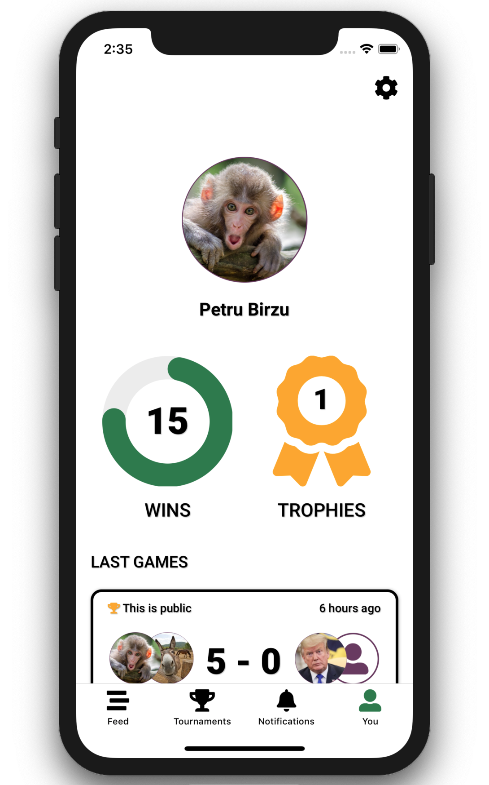
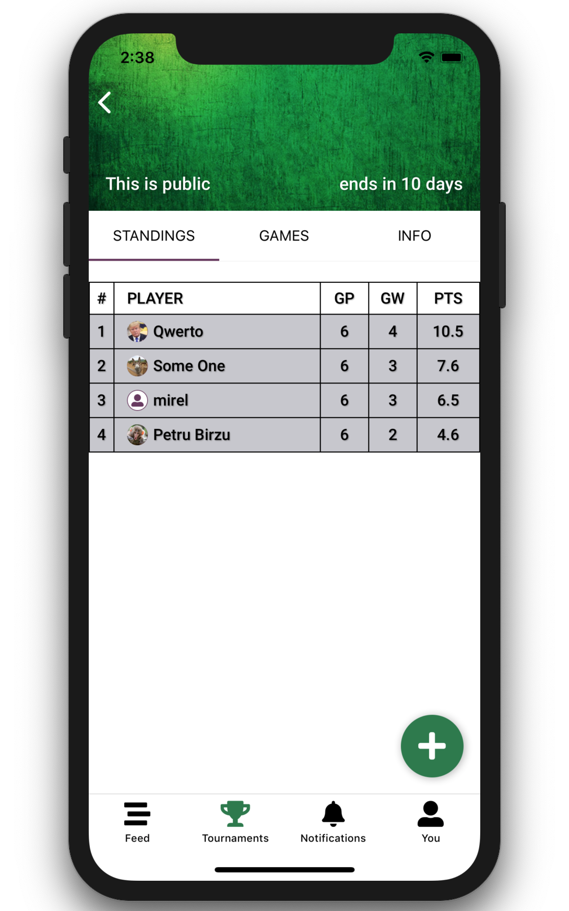

  

#  Foosball App

> React Native cross-platform app that makes it easy and engaging for people to keep track of office leisure competitions, specifically foosball  
> The app gets data served through the [backend graphQL api](https://github.com/petr166/foosball-api), check out the repo for more on that

## Prerequisites

- NodeJs with npm
- the setup with either Android Studio or XCode as described here https://facebook.github.io/react-native/docs/getting-started

## Run the app

- run `npm i` to install node modules
- start the Android or iOS simulator
- run `npm run ios` or `npm run android`
- wait for the app to start on the simulator

## Features

- Have an account, used for authentication and associated with a user profile
- Create foosball tournaments and invite participants
- Search and join available tournaments
- View tournament standings
- Log games within a tournament
- View other users’ profile and stats
- View the timeline of past games

  

## Technologies

> these are the main technologies and/or modules used, for all libraries check [package.json](package.json)

- [React Native](https://reactnative.dev) - framework for building cross-platform apps using React
  - [Typescript](https://www.typescriptlang.org) - superset of Javascript, adding types and more
  - [RN Navigation](https://github.com/wix/react-native-navigation) - native platform navigation library
  - [RN SVG](https://github.com/react-native-community/react-native-svg) - provides support for SVG in react native
  - [RN Async Storage](https://github.com/react-native-community/async-storage) - persistent key-value storage system
- [GraphQL](https://graphql.org) - api query language, for efficient app-server data exchange
  - [React Apollo](https://github.com/apollographql/react-apollo) - graphQL frontend consumer implementation built for React
    > check out the [backend implementation](https://github.com/petr166/foosball-api)
- [Moment](https://momentjs.com) - helps with date/time parsing and display
